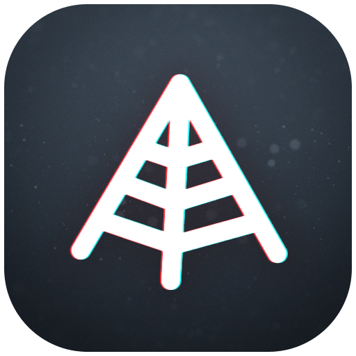
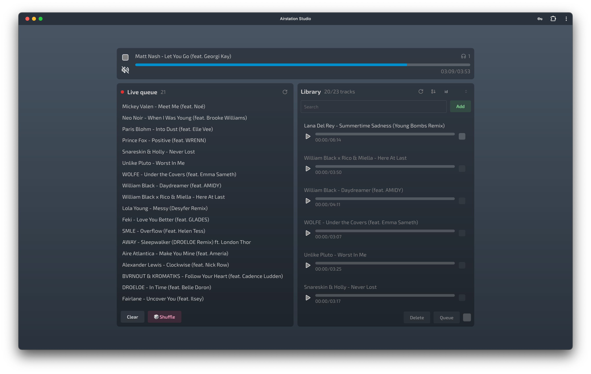
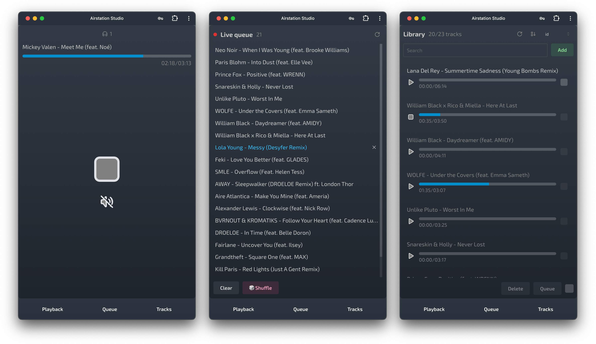
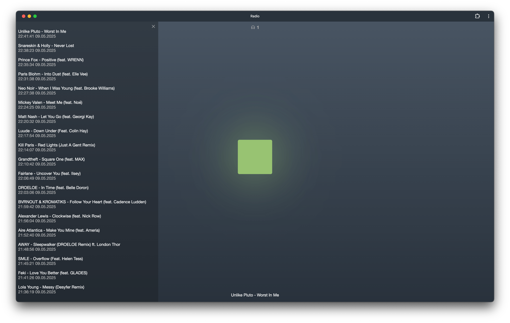

 

  

<h2 align="center">Airstation</h2>

Your own online radio station

🔍 <a href="./docs/overview.md">Overview</a> · ⚙️ <a href="./docs/installation.md">Installation</a> · 🚨 <a href="https://github.com/cheatsnake/airstation/issues/new">Bug report</a>

 

Airstation is a self-hosted web app for streaming music over the internet. It features a simple interface for uploading tracks and managing the playback queue, along with a minimalistic player for listeners. Under the hood, it streams music over HTTP using HLS, stores data in SQLite, and leverages FFmpeg for audio processing — all packaged in a compact Docker container for easy deployment.

Made for fun

<a href="https://github.com/cheatsnake/airstation/blob/master/LICENSE">LICENSE</a> 2025 - Present</div