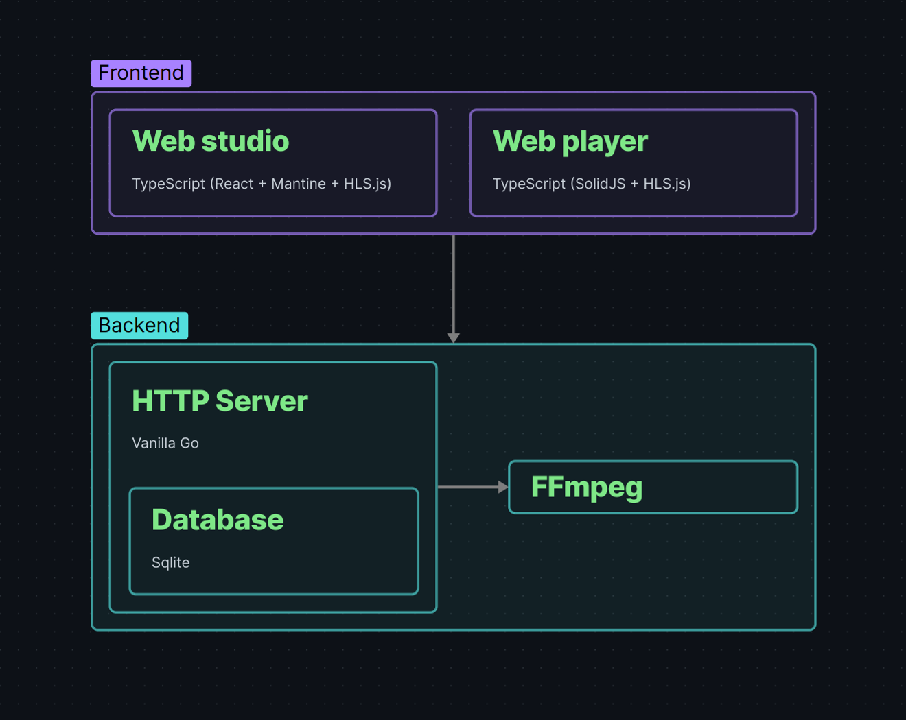
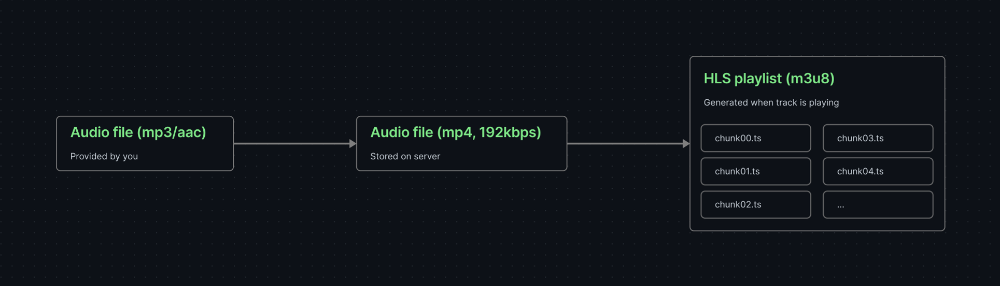
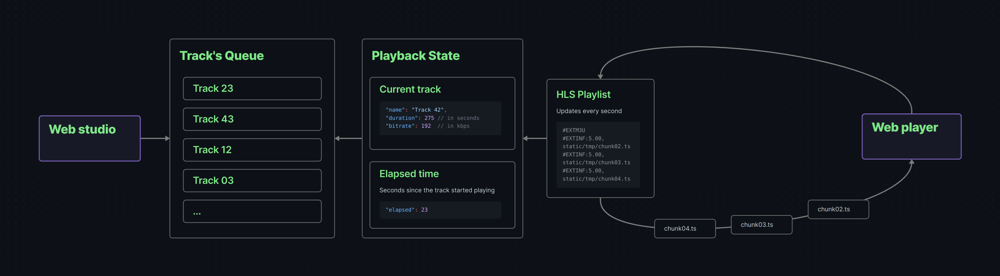

# Overview

Airstation allows you to organize your own internet radio station where your audio tracks will be played. The application was created with the purpose of being extremely simple and affordable way to organize your own radio. In fact, I don't even know if it makes sense to describe any user documentation, because all the applications can be presented in two screenshots.

Logically, the frontend part of the application can be divided into 2 parts. The first is the control panel where the radio station is controlled. The second is a minimalistic radio player for listeners.

The backend part is also arranged quite simply. [SQLite](https://en.wikipedia.org/wiki/SQLite) database is used to store track metadata and playback history. The tracks themselves are stored on the server in a folder for static files. After the tracks are uploaded, they are processed through [FFmpeg](https://en.wikipedia.org/wiki/FFmpeg) (transcoded to the same format). And finally at the moment of playback, through the same FFmpeg, [HLS](https://en.wikipedia.org/wiki/HTTP_Live_Streaming) playlists are created from the tracks.

Each track added to the station and played goes through several lifecycle stages:

- First, as the station owner, you upload the track to the server. Typically, these are `mp3` or `aac` files with varying bitrates.
- Next, all files are transcoded into a unified codec and bitrate, then stored permanently on the server.
- When it's time to play the track, it is converted into an `m3u8` playlist — essentially, the audio file is split into 5-second chunks for progressive streaming to the station's listeners.

To ensure all listeners are at the same point in track playback, a special playback state object is used. While the station is running, the following lifecycle occurs:

- The object selects the first track in your queue and generates a temporary HLS playlist by splitting the track into small chunks (typically 5 seconds each).
- As soon as the track enters the playback state, playback time starts counting.
- Based on the elapsed time, the corresponding chunks are selected from the playlist (usually at least 3 chunks to provide a buffer on the listener's side).
- Each listener periodically requests the current chunks to maintain uninterrupted playback.

## Main features

In fact, only the most necessary functionality has been implemented at the current stage:

- Permanent storage of tracks in the library
- Ability to listen to added tracks
- Ability to delete tracks from the library
- Search for tracks in the library
- Sort tracks by date added, name, duration.
- Creating a track queue
- Changing the current track queue
- Cyclic queue mode
- Possibility to randomly mix the queue
- Possibility to temporarily stop the radio station
- Playback history
- Listener counter

## Who is this app suitable for?

Anyone can actually have their own radio station - we all listen to music. And it's really great to share your musical flavor with friends or your own audience. All you need is a private [VPS server](https://en.wikipedia.org/wiki/Virtual_private_server) on which you can deploy your station. In fact, it costs pennies and you don't need to become a system administrator or Linux guru. One [YouTube video tutorial](https://www.youtube.com/results?search_query=how+to+vps) will open up a new world of [self-hosted solutions](https://github.com/awesome-selfhosted/awesome-selfhosted).