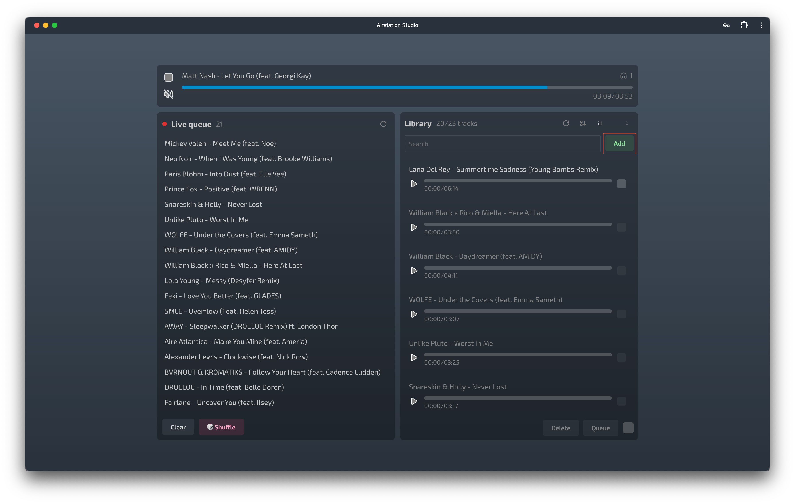
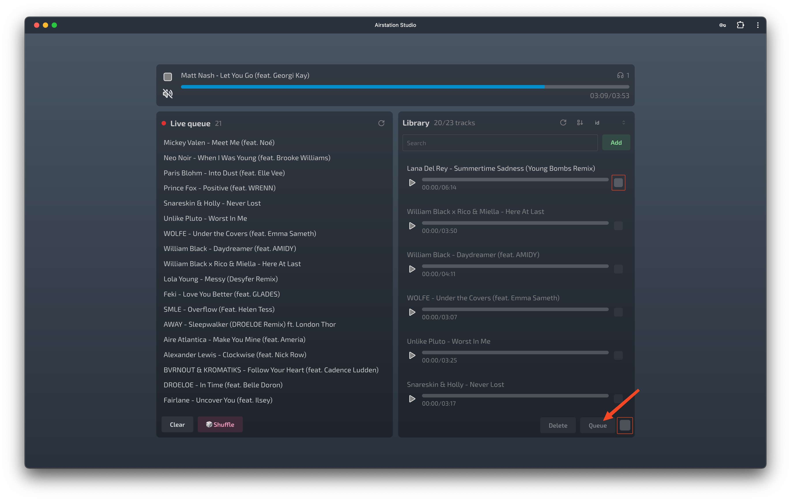
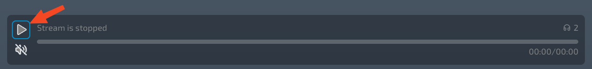

# Usage

This guide walks you through the essential steps to use Airstation, from uploading your music tracks to broadcasting them on your very own internet radio station.

## 1. Accessing Airstation Studio

Once your Airstation application is installed and running, the first step is to open the Airstation Studio. This is the control panel where you'll manage your station.

You can typically access it by navigating to the following URL in your web browser:
[http://localhost:7331/studio/](http://localhost:7331/studio/) 

## 2. Uploading Music

With the Airstation Studio open, you can start building your music library.
1.  Look for an `Add` button or a similar option to upload music.
2.  Clicking this button will allow you to select audio files from your computer and upload them to the Airstation backend.

The Airstation Studio interface will guide you through the process of adding tracks.

## 3. Managing the Playback Queue

After your music is uploaded, you need to tell Airstation which tracks to play and in what order. This is done by creating a playback queue.
1.  In your music library within the Studio, select the tracks you want to add to the queue. This is usually done by checking boxes next to each track.
2.  Once you've selected your desired tracks, click the `Queue` button to add them to the station's playlist.

You can typically manage this queue further, for example, by reordering or shuffling tracks.

## 4. Starting Your Radio Broadcast

When your queue is ready, it's time to start broadcasting your radio stream.
1.  Find the control to start the station, often labeled `Start Playback of the Stream` or similar.
2.  Clicking this will begin the stream, making your selected music available to listeners.

## 5. Listening to Your Station

With your Airstation broadcasting, anyone (including yourself) can tune in using the Airstation Player.
1.  Open the Airstation Player URL in a web browser. This is usually the root URL of your Airstation instance (e.g., [http://localhost:7331/](http://localhost:7331/)).
2.  In the player interface, click the `Play` button to start listening to your live stream.

Enjoy your personalized internet radio experience!
